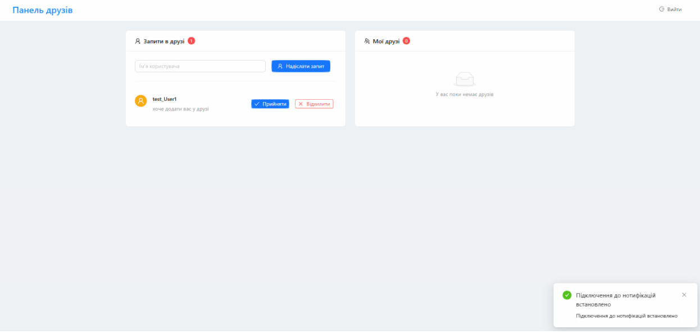

# 🤝 RequestSystem — User Friendship Microservice System

## 📘 Project Overview

**RequestSystem** is a microservice-based system that allows users to manage friendship interactions. It provides endpoints for sending, accepting, declining, and deleting friend requests, along with listing friends and incoming requests. The system features user authentication, inter-service communication via RabbitMQ, and caching using Redis.

---

## 🔧 Functionality

### ✅ FriendshipService

* Send friend requests
* Accept or decline incoming requests
* Remove friends from the list
* Retrieve lists of friends and pending requests

### 🛂 AuthService

* User registration and login
* JWT token generation and validation
* Role-based access control

### 🧠 CommonService

* Shared models and utility classes for reuse across services

### 📩 NotifyService

* Notification dispatching via RabbitMQ

---

## 🗂 Project Structure

- `ApiGateway`             # Entry point for routing and forwarding
- `AuthService`            # Handles authentication and authorization
- `Common`                 # Contains shared models/utilities
- `FriendShipService`      # Core friendship features
- `NotifyService`          # Notification handler
- `docker-compose.yml`     # Docker orchestration for all services


## ⚙️ Tech Stack
- **Java 17** + Spring Boot
- **Spring Security / Web / Data JPA**
- **PostgreSQL** — persistent storage
- **RabbitMQ** — asynchronous messaging
- **Redis** — in-memory cache
-  **WebSockets, STOMP** - notifications
- **Docker / Docker Compose** — containerization and service orchestration

---
## 📫 API Highlights

All endpoints are prefixed with `/friendship` in the `FriendShipService`.

* `POST /request/{receiver}` – send friend request
* `PUT /accept/{sender}` – accept request
* `PUT /decline/{sender}` – decline request
* `GET /friends` – get friend list
* `GET /requests` – list incoming friend requests
* `DELETE /delete/{friend}` – remove a friend

## 🚀 How to Build & Run

### Prerequisites:
- Docker & Docker Compose installed
- Java 17 (for manual builds)

### Run with Docker:
```bash
./gradlew build

docker-compose up --build

## 🖼️ Result Preview

